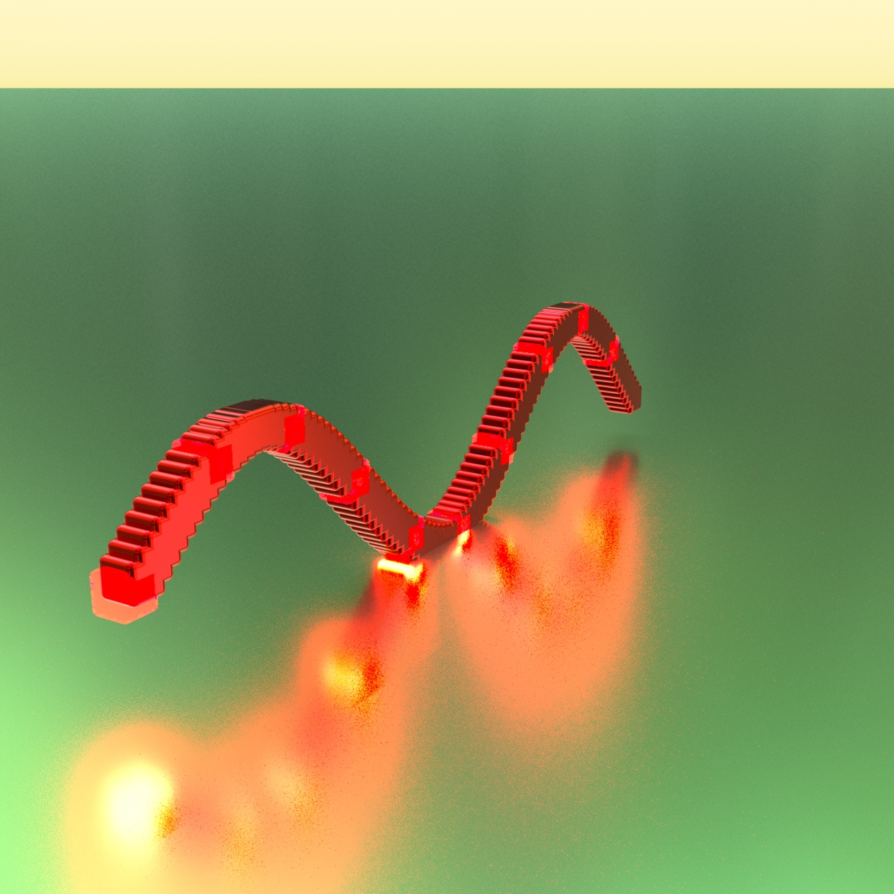

# poomer-bella-sine
Learning prototype cross-platform command line for Bella scene creation with sine wave. Depends on https://github.com/oomer/oom



# Demonstrates
- Auto camera framing of sine wave
- Bella scene file writing
- Using Diffuse Logic's logging
- Using render event callbacks with EngineObserver override
- Use of arguments
- Adding quickmaterials to the scene
- Shows how to wire node output ie belVoxelMat1["color"] |= belColor1.output("outColor");
- Using both procedural Bella box and a mesh box modelled from Blender
- Hiding boilerplate code like cube mesh and basic Bella scene population in .h files 

# Usage

```
poomer-bella-sine #generates a 100 voxel sine plot, output .bsa
poomer-bella-sine -n:1000 # plot 1000 voxels on sine curve
poomer-bella-sine -or:16 # render 16 frames of camera orbit
poomer-bella-sine -sa:60 # sets amplitude
poomer-bella-sine -sf:0.55 # sets sine frequency
poomer-bella-sine -cv:0.65 # sets color variation
poomer-bella-sine -em # sets one material per voxel plot with gradient
poomer-bella-sine -r # render current image
poomer-bella-sine -s:2 # set xfrom scale on voxels to double
poomer-bella-sine -sv # set xfrom scale on voxels using modulus
poomer-bella-sine -m:50 # set modulus event to occur every 50 voxels 
```

[todo] add checks for illegal argument values

# Build 
```
workdir/
├── build_engine_sdk/
├── oom/
└── poomer-bella-sine/
```

## MacOS (kasm-monterey) 
- [ ] Install Xcode
```
mkdir workdir
cd workdir
curl -LO https://downloads.bellarender.com/bella_engine_sdk-24.6.0.dmg
hdiutil attach bella_engine_sdk-24.6.0.dmg
cp -R /Volumes/Bella\ Engine\ SDK\ 24.6.0/bella_engine_sdk .
git clone https://github.com/oomer/oom.git
git clone https://github.com/oomer/poomer-bella-sine.git
cd poomer-bella-sine
make all -j4
bin/Darwin/release/poomer-bella-sine -r
open ./untitled.png
```

## Ubuntu Linux (kasm-ubuntu)
```
sudo apt install -y build-essential curl
mkdir workdir
cd workdir
curl -LO https://downloads.bellarender.com/bella_engine_sdk-24.6.0.tar.gz
tar -xvf  bella_engine_sdk-24.6.0.tar.gz
git clone https://github.com/oomer/oom.git
git clone https://github.com/oomer/poomer-bella-sine.git
cd poomer-bella-sine
make all -j4
bin/Linux/release/poomer-bella-sine -r
file ./untitled.png
```

## Windows (kasm-win11pro) 
- [optioanl] Install https://git-scm.com

- Download Visual Studio Community Edition 2022
- Run VisualStudioSetup.exe
- Workload = [x] Desktop developemnt with C++
- Individial components = [x] Git For Windows

Run **x64 Native Tools Command Prompt for VS 2022**
```
cd %USERPROFILE%
mkdir workdir\bella_engine_sdk
cd workdir\bella_engine_sdk
curl -LO https://downloads.bellarender.com/bella_engine_sdk-24.6.0.zip
tar -xf bella_engine_sdk-24.6.0.zip 
cd ..
git clone https://github.com/oomer/oom.git
git clone https://github.com/oomer/poomer-bella-sine.git
cd poomer-bella-sine
msbuild poomer-bella-sine.vcxproj /p:Configuration=release /p:Platform=x64 /p:PlatformToolset=v143 
x64\release\poomer-bella-sine.exe -r
start ./untitled.png
```

